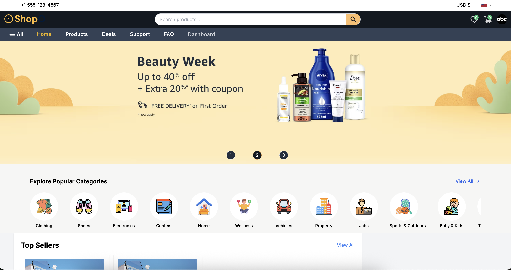
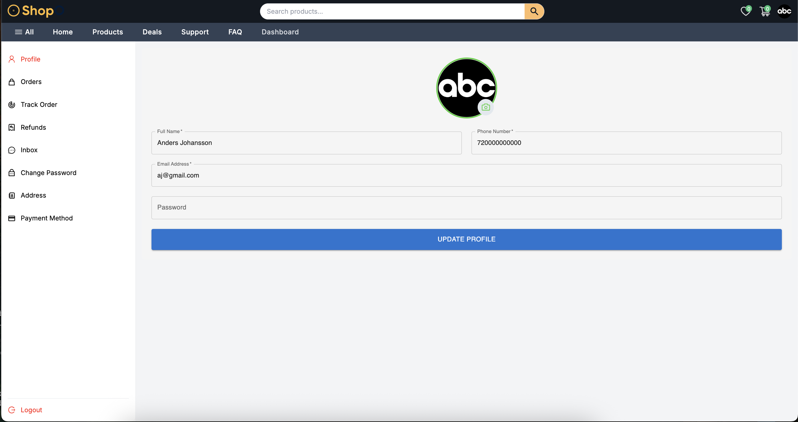
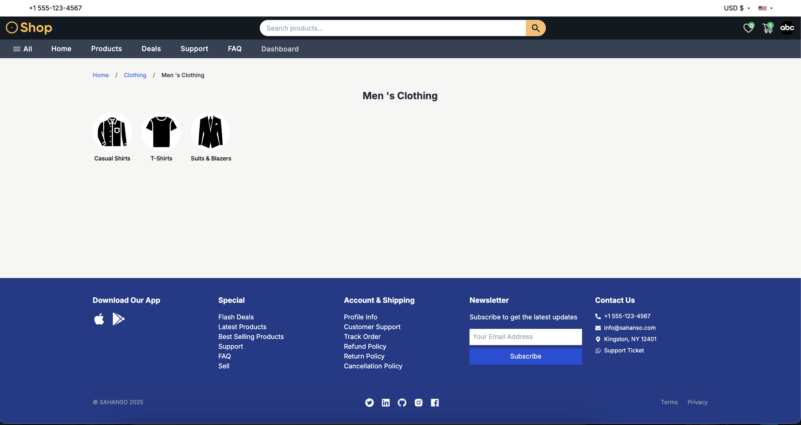
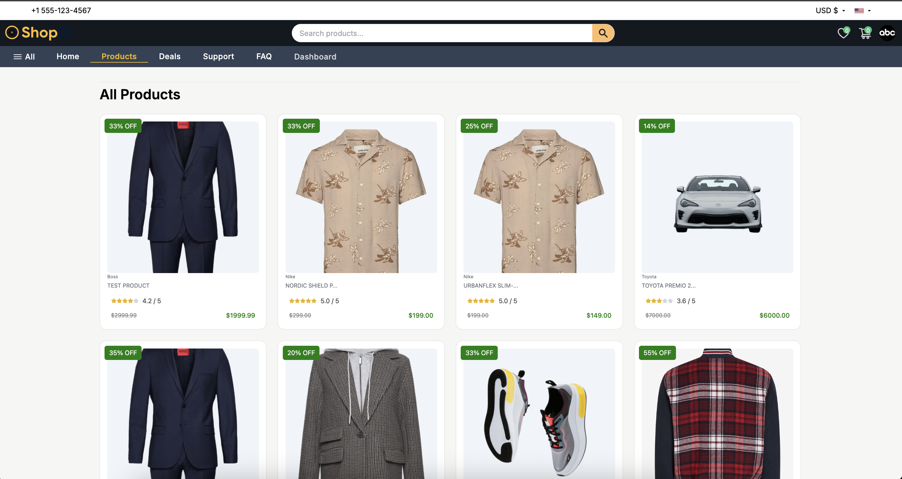
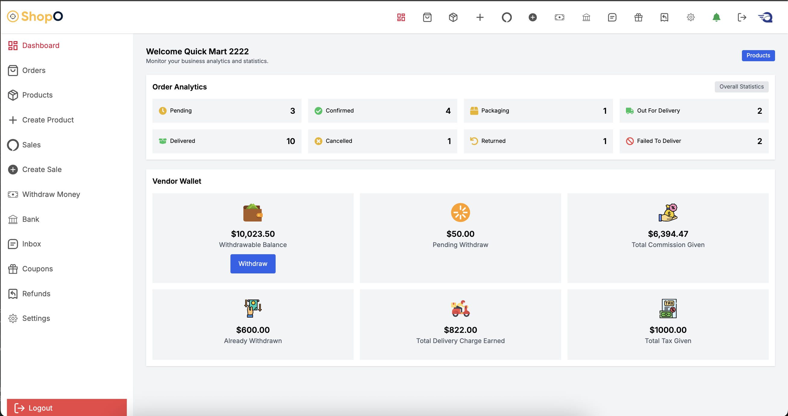
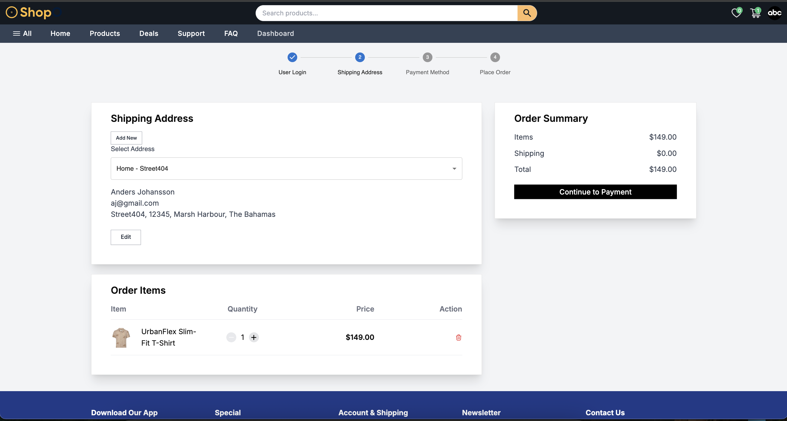
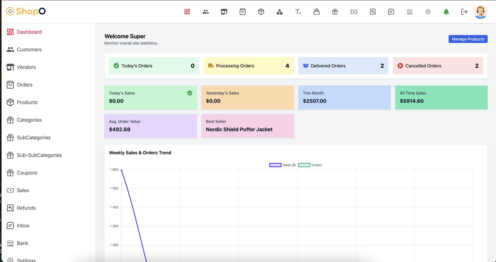
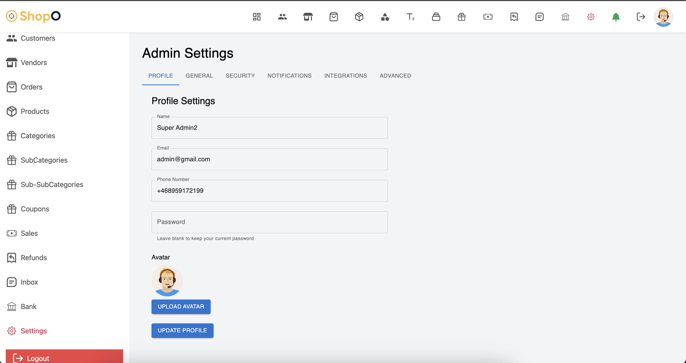

# menn-multivendor-marketplace
A full-featured multivendor ecommerce marketplace built with the MENN stack (MongoDB, Express.js, Next.js, Node.js). 

## Live Demo
- Storefront: [menn-multivendor-marketplace-store.vercel.app](https://menn-multivendor-marketplace.vercel.app)  
- Admin Dashboard: [menn-multivendor-marketplace-admin.vercel.app](https://menn-multivendor-marketplace-9f9v.vercel.app/)  

## Screenshots

Features (broken into roles)

- Users: Browse products, add to cart/wishlist, checkout, track orders.
- Vendors: Manage products, view orders, sales reports.
- Admins: Manage users, vendors, site settings, maintenance mode.
- Global: Currency selector, SEO-friendly Next.js pages, responsive UI.

## Tech Stack
- Frontend: Next.js (React), TailwindCSS, Redux Toolkit
- Backend: Node.js, Express.js, MongoDB, Cloudinary
- Deployment: Vercel (frontend), Render (backend)
- Authentication: JWT & NextAuth
- Other: Mongoose, Axios, React-Toastify

## Installation

# Clone the repo
git clone https://github.com/your-username/menn-multivendor-marketplace.git
cd menn-multivendor-marketplace

# Backend
cd backend
npm install
npm run dev

# Frontend
cd frontend
npm install
npm run dev

# Frontend Admin
cd frontend-admin
npm install
npm run dev

## Demo Accounts
- **Admin**: admin@gmail.com / Test1234!
- **Vendor**: vendor@gmail.com / Test1234!
- **User**: aj@gmail.com / Test1234!
